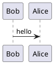

# PlantUML


## Directly in markdown



## Generated by PlantUML server

- http://www.plantuml.com/plantuml/uml/SyfFKj2rKt3CoKnELR1Io4ZDoSa70000
- http://www.plantuml.com/plantuml/png/SyfFKj2rKt3CoKnELR1Io4ZDoSa70000
- http://www.plantuml.com/plantuml/svg/SyfFKj2rKt3CoKnELR1Io4ZDoSa70000
- http://www.plantuml.com/plantuml/txt/SyfFKj2rKt3CoKnELR1Io4ZDoSa70000

### Generated PNG image

```html

```


### Generated SVG image

```md

```


## Gravizo

Images generated by server with using PlantUML syntax

http://www.gravizo.com

### Generated image with img tag

```html
 Alice : hello;
    @enduml;
">
```

 Alice : hello;
    @enduml;
">

### Generated image with markdown

```md

```


